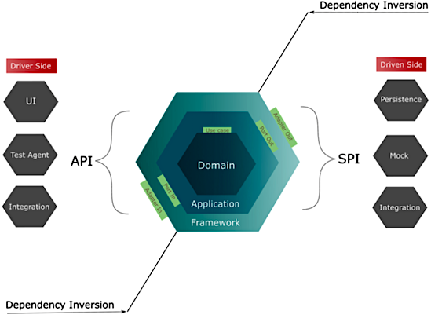

Overview
========

Software architecture is inspired by hexagonal architecture.

**Hexagonal architecture:**

* Suitable for implementing a particular microservice.
* Standardize the way software is developed.
* Separate business code from technology code.
* Makes clear separation between domain/business logic and integration with input/output outside
  world.
* Based on DDD (Domain Driven Design).

* Testability.
* Maintainability.
* Change tolerant.

**Domain hexagon** - a place where the business code exist. Model a real-world problem. Isolated and
protected from any technology concern. DDD principles.\
*Domain classes, value objects and domain services, business rules.*

**Application hexagon** - application-specific operations. Express software's user intent and
features.
Use, process, orchestrates the business rules from domain hexagon.\
*Use cases, services, repository interfaces (output ports).*

**Framework hexagon** - provides outside world interface. Input/output APIs. Persistence layers.

Input adapters, *driving operations* - *REST API. Receiving asynchronous messages.*

Output adapters, *driven operation* - consume (fetch) things from external resources.\
*Database connection, ORM. Sending asynchronous messages.*

Architecture
============

| Hexagon         | Java Package                                                                        |
|-----------------|-------------------------------------------------------------------------------------|
| **Domain**      | 📦 `domain`                                                                         |
| **Application** | 📦 `services`                                                                       |
| *repositories*  | `services.CountryOutputPort`                                                        |
| **Framework**   | 📦 `api`                                                                            |
| *inputs*        | `api.rest.v1`                                                                       |
| *outputs*       | `api.restclient`                                                                    |
|                 | `api.restclient.CountriesRestAdapter` Integration with country list remote service. |

Project structure
=================

All files are relative to `<project-dir>`.

`/HELP.md` Spring Boot overview documentation generated by Spring Boot initializer.

`/README.md` Project overview documentation.

`/doc`

* Project documentation.

`/project/`

* Assets for project development, code quality tools, etc.

`/project/checkstyle-<version>/`

* Code style definition.
* The Google's checks definition for Checkstyle tool.

* Use this Google's checks definition for your IDE's Checkstyle plugin for code style consistency
  across various IDEs.
* Integrated with Maven build `validate` phase in `pom.xml`.

All other files are part of the standard Maven project structure.

---

